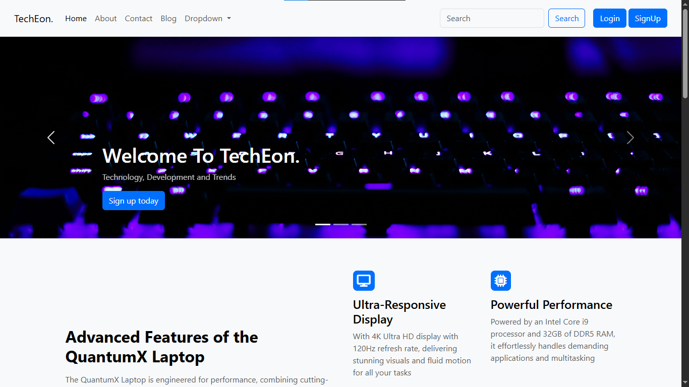

# QuantumX Laptop - Responsive Bootstrap Frontend

A sleek, responsive website UI for **QuantumX**, a high-performance laptop brand. Built with HTML, CSS, and Bootstrap 5, this frontend project highlights product features, modern UI design, and responsive layout tailored for tech product promotion.

## 🚀 Live Demo
👉 [Click here to view the site](https://askdanish144.github.io/TechEon-laptop-bootstrap-frontend/)

## 📌 Features

- 💻 **Modern Hero Section** with product-focused carousel
- 📱 **Fully Responsive Layout** across mobile, tablet, and desktop
- 💡 **Feature Highlights** section for technical specs
- 🧩 Built using **Bootstrap 5**

## 🧰 Tech Stack

- HTML5
- CSS3
- Bootstrap 5
- Font Awesome (for icons)

## 🧑‍💼 Use Case

This template is ideal for:
- Tech startups
- Laptop or electronics sellers
- Digital product showcase pages

## 💡 Using This Repo

This project is intended solely for portfolio and demonstration purposes.

Clone the repo:
   git clone https://github.com/askdanish144/TechEon-laptop-bootstrap-frontend.git

## ✨ Author

Crafted with attention to detail by **Danish Ali– Full Stack Developer & Graphic Designer**

GitHub: https://github.com/askdanish144

## 📬 Want a website like this?

I'm available to build responsive, business-focused websites tailored to any industry, whether you're a startup, local business, or growing brand.
➤ Email me at `askdanish144@gmail.com` to start a conversation.
